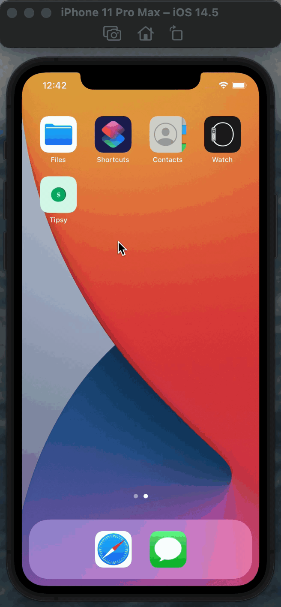

⚠️ Feel free to download source code and change it by your own.
<h2>☑️ What is this app about?</h2>

Beautiful bill splitting, tip calculating app. No one can work out $145.56 split between 5 people with a 20 percent tip. With this Tipsy app in hand, you’ll never need to do maths ever again!

<h2>☑️ What did I learn?</h2>
<ul>
  <li>How to create multi-screen apps with animated navigation.</li>
  <li>Optional binding, optional chaining and the nil coalescing operator.</li>
  <li>How to create classes and difference between classes and structs.</li>
  <li>Pass by value vs. pass by reference.</li>
  <li>Formatting Strings.</li>
  <li>Color literals.</li>
</ul>
<h2>☑️ Final look of Tipsy app➕</h2>

